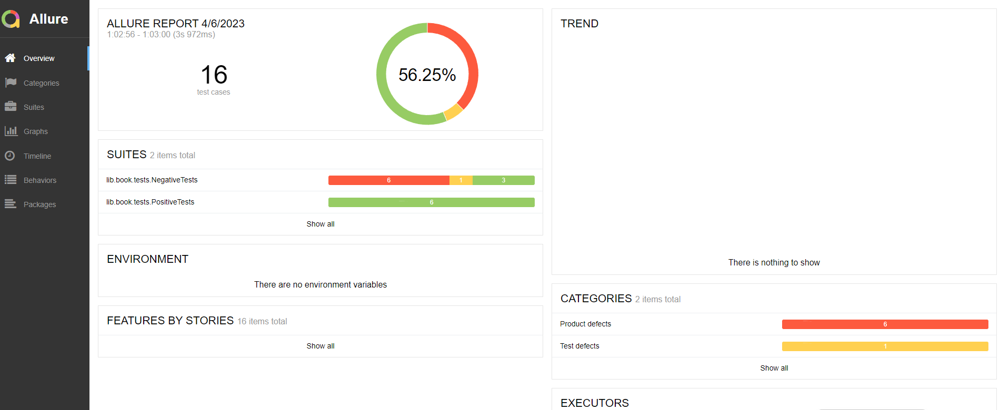

# Проект по автоматизации тестирования API
## Тест-кейсы
<table width="100%" border='0'>
   <tr> 
    <td valign="middle"><strong>Название</strong></td><td valign="middle"><strong>Приоритет</strong></td><td valign="middle"><strong>Статус</strong></td></tr>
   <td valign="middle"><strong>Получение данных о всех книгах</strong></td><td valign="middle"><strong>High</strong></td><td valign="middle"><strong>Passed</strong></td></tr>
   <td valign="middle"><strong>Получение книги по Id</strong></td><td valign="middle"><strong>High</strong></td><td valign="middle"><strong>Passed</strong></td></tr>
<td valign="middle"><strong>Соответствие загруженных данных полученным</strong></td><td valign="middle"><strong>High</strong></td><td valign="middle"><strong>Passed</strong></td></tr>
<td valign="middle"><strong>Возможность создания новой книги</strong></td><td valign="middle"><strong>High</strong></td><td valign="middle"><strong>Passed</strong></td></tr>
<td valign="middle"><strong>Возможность обновления информации о книге</strong></td><td valign="middle"><strong>High</strong></td><td valign="middle"><strong>Passed</strong></td></tr>
<td valign="middle"><strong>Возможность удаления книги</strong></td><td valign="middle"><strong>High</strong></td><td valign="middle"><strong>Passed</strong></td></tr>
<td valign="middle"><strong>Возможность создания книги без названия</strong></td><td valign="middle"><strong>High</strong></td><td valign="middle"><strong>Failed:exclamation:</strong></td></tr>
<td valign="middle"><strong>Возможность создания книги с отрицательным значение для поля год</strong></td><td valign="middle"><strong>High</strong></td><td valign="middle"><strong>Failed:exclamation:</strong></td></tr>
<td valign="middle"><strong>Получение данных о несуществующей книге</strong></td><td valign="middle"><strong>Middle</strong></td><td valign="middle"><strong>Passed</strong></td></tr>
<td valign="middle"><strong>Возможность обновления информации о несуществующей книге</strong></td><td valign="middle"><strong>Middle</strong></td><td valign="middle"><strong>Passed</strong></td></tr>
<td valign="middle"><strong>Возможность удаления несуществующей книги</strong></td><td valign="middle"><strong>Middle</strong></td><td valign="middle"><strong>Passed</strong></td></tr>
<td valign="middle"><strong>Возможность создания книги с дробным значением для поля год</strong></td><td valign="middle"><strong>Middle</strong></td><td valign="middle"><strong>Failed:exclamation:</strong></td></tr>
<td valign="middle"><strong>Возможность создания книги с пустым значением для поля электронная книга</strong></td><td valign="middle"><strong>High</strong></td><td valign="middle"><strong>Failed:exclamation:</strong></td></tr>
<td valign="middle"><strong>Возможность создания книги с текстовым значением для поля электронная книга</strong></td><td valign="middle"><strong>Middle</strong></td><td valign="middle"><strong>Failed:exclamation:</strong></td></tr>
<td valign="middle"><strong>Возможность создания книги с пустым значением для поля автор</strong></td><td valign="middle"><strong>Middle</strong></td><td valign="middle"><strong>Failed:exclamation:</strong></td></tr>
<td valign="middle"><strong>Возможность создания книги с числовым значением для поля автор</strong></td><td valign="middle"><strong>Middle</strong></td><td valign="middle"><strong>Failed:exclamation:</strong></td></tr>
   </tr>
  </table>
   

## Bug report
<table width="100%" border='0'>
   <tr> 
    <td valign="middle"><strong>Название</strong></td><td valign="middle"><strong>Шаги</strong></td><td valign="middle"><strong>Ожидаемый результат</strong></td><td valign="middle"><strong>Фактический результат</strong></td><td valign="middle"><strong>Критичность</strong></td></tr>
 <td valign="middle"><strong>Возможность создания книги без названия</strong></td><td valign="middle"><strong>1.Настроить окружение для отправки API 2. В поле name передать пустое значение 3. Отправить запрос</strong></td><td valign="middle"><strong>Книга не создалась</strong></td><td valign="middle"><strong>Книга создалась</strong></td><td valign="middle"><strong>High</strong></td></tr>
  <td valign="middle"><strong>Возможность создания книги с отрицательным значение для поля год</strong></td><td valign="middle"><strong>1.Настроить окружение для отправки API 2. В поле year передать отрицательное значение 3. Отправить запрос</strong></td><td valign="middle"><strong>Книга не создалась</strong></td><td valign="middle"><strong>Книга создалась</strong></td><td valign="middle"><strong>High</strong></td></tr>
    <td valign="middle"><strong>Возможность создания книги с дробным значением для поля год</strong></td><td valign="middle"><strong>1.Настроить окружение для отправки API 2. В поле year передать дробное значение 3. Отправить запрос</strong></td><td valign="middle"><strong>Книга не создалась</strong></td><td valign="middle"><strong>Книга создалась</strong></td><td valign="middle"><strong>Middle</strong></td></tr>
    <td valign="middle"><strong>Возможность создания книги с пустым значением для поля электронная книга</strong></td><td valign="middle"><strong>1.Настроить окружение для отправки API 2. В поле electronic book передать пустое значение 3. Отправить запрос</strong></td><td valign="middle"><strong>Книга не создалась</strong></td><td valign="middle"><strong>Книга создалась</strong></td><td valign="middle"><strong>High</strong></td></tr>
      <td valign="middle"><strong>Возможность создания книги с текстовым значением для поля электронная книга</strong></td><td valign="middle"><strong>1.Настроить окружение для отправки API 2. В поле electronic book передать текстовое значение 3. Отправить запрос</strong></td><td valign="middle"><strong>Книга не создалась</strong></td><td valign="middle"><strong>Книга создалась</strong></td><td valign="middle"><strong>Middle</strong></td></tr>
      <td valign="middle"><strong>Возможность создания книги с пустым значением для поля автор</strong></td><td valign="middle"><strong>1.Настроить окружение для отправки API 2. В поле author передать пустое значение 3. Отправить запрос</strong></td><td valign="middle"><strong>Книга не создалась</strong></td><td valign="middle"><strong>Книга создалась</strong></td><td valign="middle"><strong>Middle</strong></td></tr>
      <td valign="middle"><strong>Возможность создания книги с числовым значением для поля автор</strong></td><td valign="middle"><strong>1.Настроить окружение для отправки API 2. В поле author передать числовое значение 3. Отправить запрос</strong></td><td valign="middle"><strong>Книга не создалась</strong></td><td valign="middle"><strong>Книга создалась</strong></td><td valign="middle"><strong>Middle</strong></td></tr>
   </tr>
  </table>
   

## Allure Report

